# Proyecto Final de android
El proyecto consiste en mostrar información de los sitios favoritos que el usuario agrega a la aplicación, la APP muestra el estado del tiempo, contaminación y predicciones de tiempo en los siguientes dias, la aplicación tambien permite agregar localidades mediente una búsqueda del poblado en google maps, por lo que es necesario agregar el archivode recuros API_KEY donde se define la clave proporcionada por google. Toda la información del clima, contaminación y pronótico del tiempo, es recolectado mediante el consumo de servicios proporcionadod por OpenWeather (  <a href="https://openweathermap.org">Enlace</a> )

La figura siguiente muestra la primera vista al abrir la aplicación, al inicio por defecto se muestra la información del estado del clima de Ciudad Universitaria.

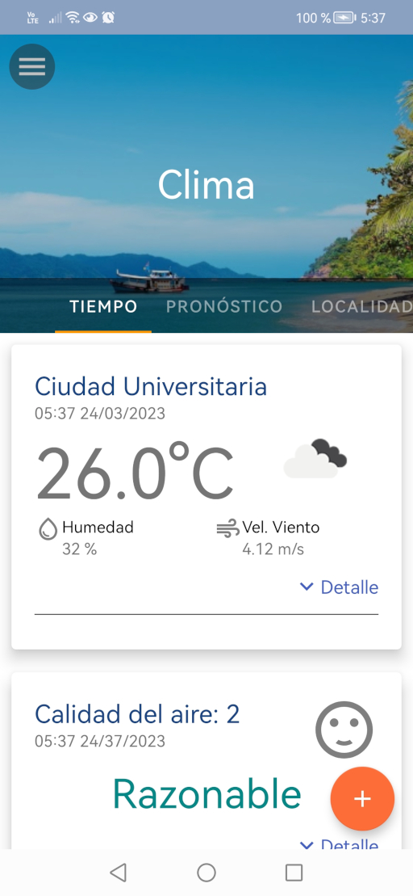

La aplicación se navega mediante tres taps: 
- Tiempo:  Muestra información del estado del tiempo mas actual y la calidad del aire de la ciudad seleccionada, se incluye información como: temperatura, humedad, presión 
- Pronóstico: Muestra el pronóstico del tiempo de la ciudad de la ciudad seleccionada
- Localidad: Muestra las localidades registradas para poder visualizar sus condiciones metereológicas

## Tiempo
En este pagina se muestran dos tarjetas: Estado del tiempo y el ídice de la calidad del aire, las tarjetas tienen una opción para ver mas información. 

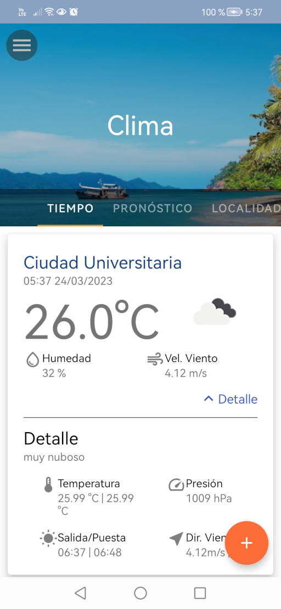

## Pronóstico
Esta sección muestra el proóstico del tiempo a lo largo de las siguientes horas y dias de la localidad seleccionada

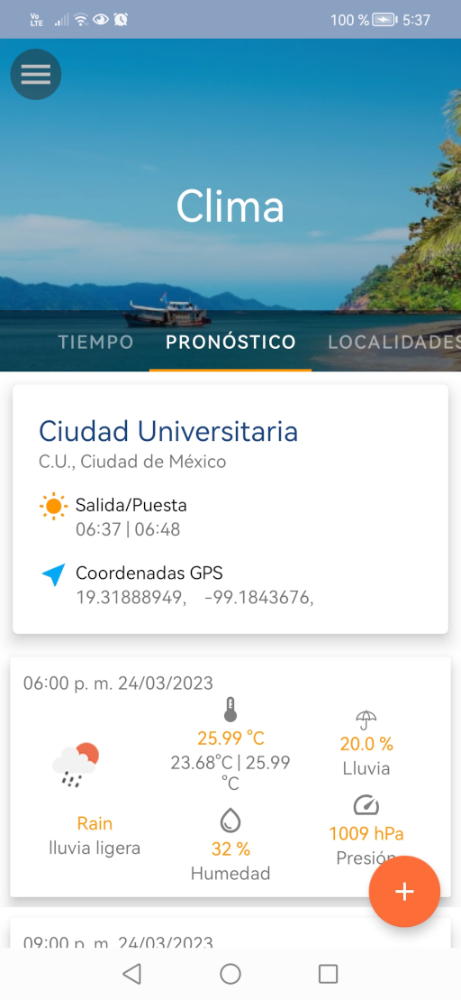

## Localidad
en esta página se puede registarr los lugares deseados para mostrar información del estado del tiempo. La siguiente figura muestra la página inicial cualdo no se ha agregado ninguna localidad 

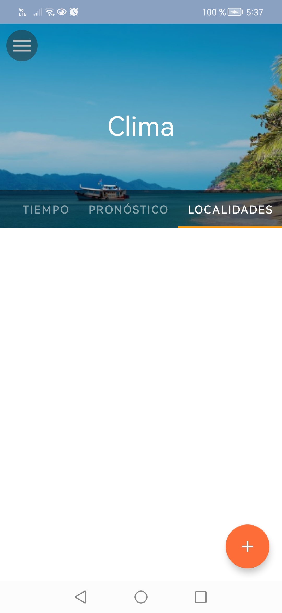{width=40px}

### Agregar Localidad

PAra agregar una localidad se debe presionar el botón naranja que se encuentra en la parte inferior, lo que mostrará una partalla para registra información detallada de las localidades como: Nombre, estado, pais, latitud, longitud, así como alguna descripción del lugar.

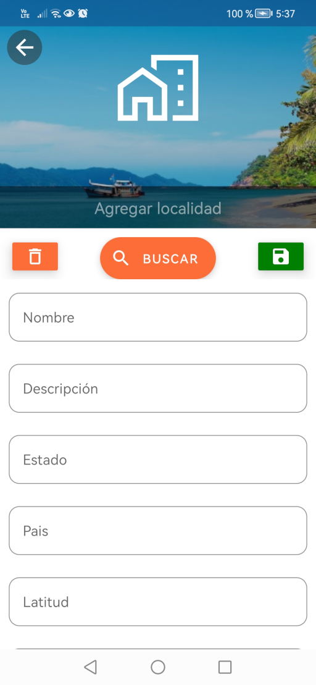

Si uno desea hacer una búsqueda en el mapa de google, se debe hacer clic en el botón buscar, lo que aparecerá la siguiente vista, donde le solicita permisos para acceder a al aubicación del dispositivo, es necesario aceptar este permiso para hacer búsquedas de localidades.

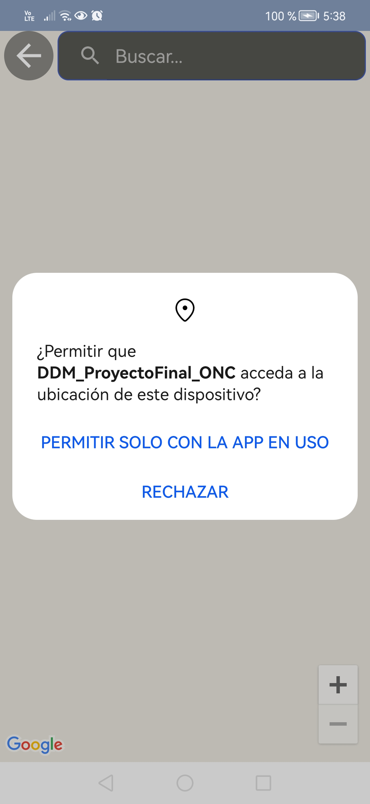

Una vez que se ha aceptado el permiso aparecerá un mapa donde se puede hacer la búsqueda de la ubicación, la siguiente imagen muestra esta característica

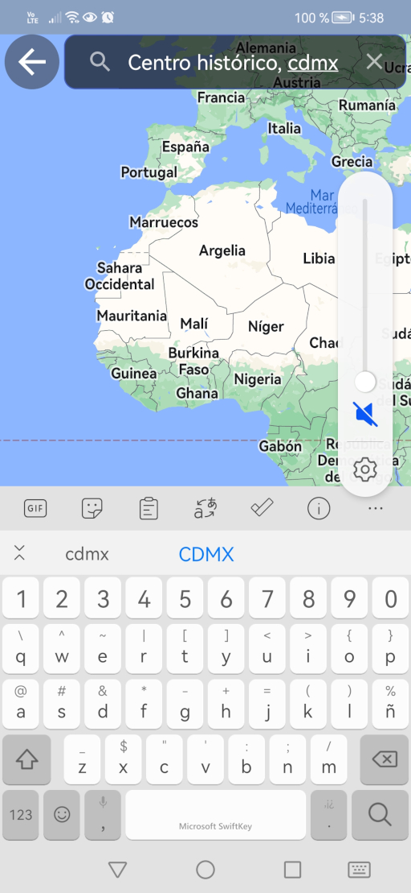

Para realicar la búsqueda de una localidad se escribe el nombre del poblado, junto con el nombre del estado o país; cuando haya terminado, ha hace clic en el botón buscar del teclado virtual, si se ha encontrado de forma correcta el sitióm mostrara un marcador de la ubicación en el mapa, la siguiente figura muestra esta vista.

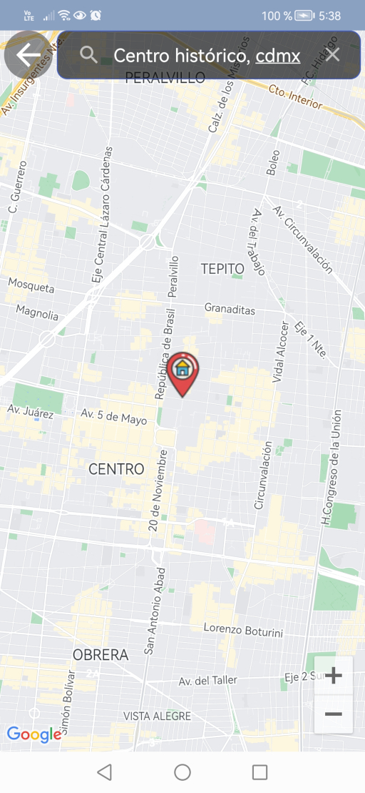

Uno puede navergar en el mapa y encontrar el sitio de forma visual, solo es necesario apretar el sitión donde se desea colocar el marcado y listo, así mismo se puede mover el marcador para tener mejor precisión del sitió a marcar (se deja apretado el marcador y se arrastra al sitio deseado)

Para concluir la búsqueda se hace clic en la frecha hacia atras colocada en la esquina superior izquierda. 

Con la información encontrada, se rellenarán los campos como se muestra en la siguiente figura.

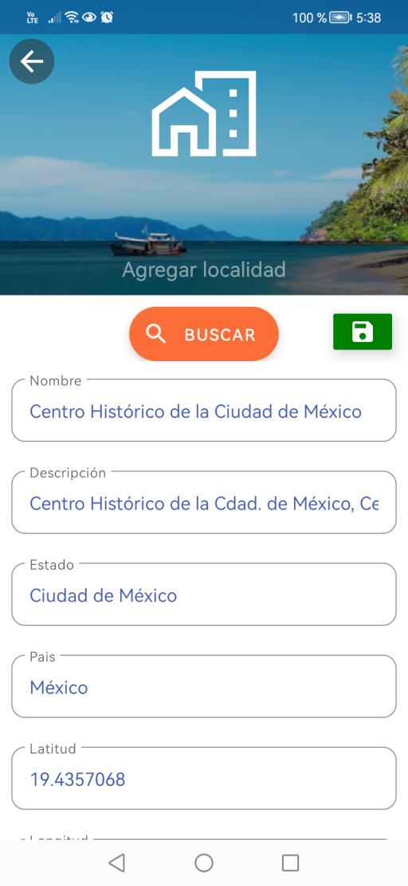

Al regresar a la ventana de edición se pueden hacer las modificaciones necesarias para finalmente guardarno apretando el ícono de salvar.

NOTA: Cuando se selecciona una ubicación mediante la seleccion directa del marcador, es necesario rellenar los campo por que solo se tendrá información de las coordenadas geoespaciales.

Una vez creada la locaidad la página de localidades aparecerá la localidad agregada 

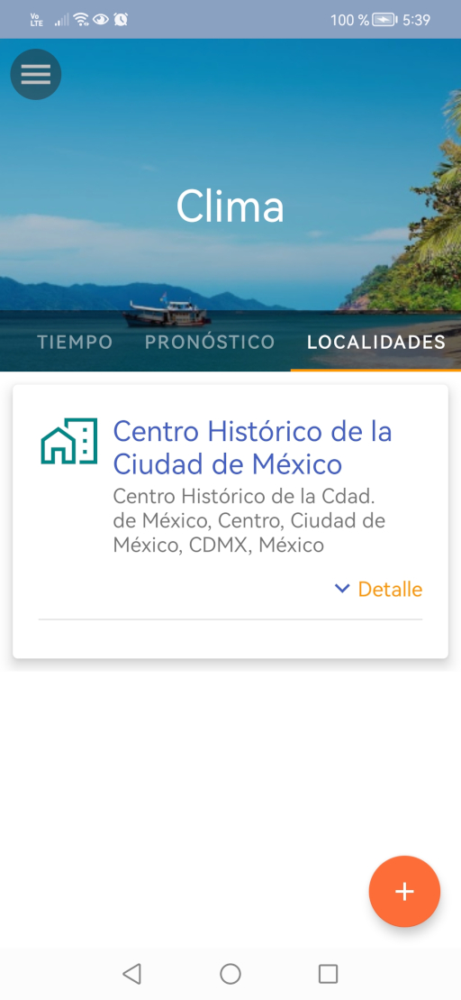

### Borrar Localidad

Existen dos formas para borrar la actividad, la primera y mas simple es dejar presionada la localidad a borrar y aparecerá un cuadro de dialogos donde confirme que desea borrar la localidad.

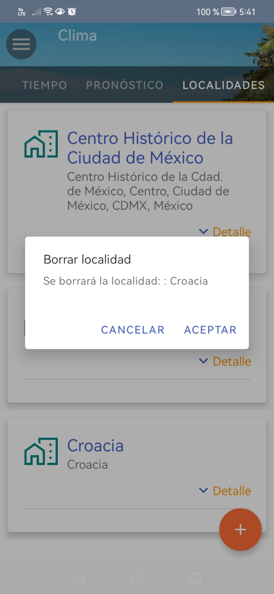

La segunda forma es seleccionando la localidad, la aplicación mostrará la vista de edición donde se prodrá modificar o borrar la localidad seleccionado.

En la parte inferior también se cuentan con botones para eliminar o guardar la localidad seleccionada

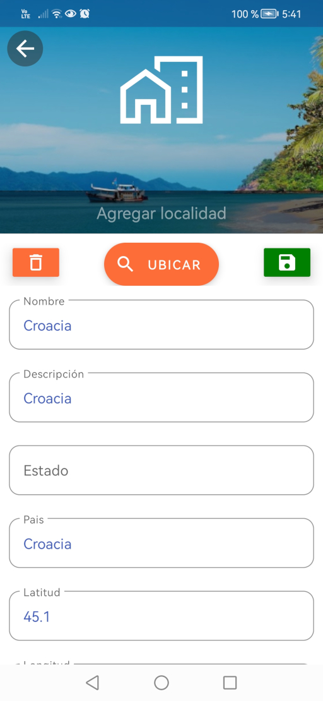

## Seleccionar una localidad para mostrar el estado de tiempo

En la parte superio en cualquiera de las páginas se muestra un boton para abrir un menú lateral, en el se puede seleccionar la localidad que se desea mostrar su información de tiempo, calidad de aire y pronóstico del clima.

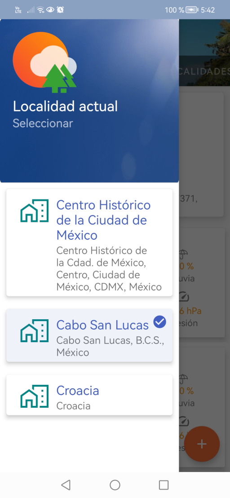

En el ménú lateral se puede hacer un clic o un clic largo para que dentro de unos segundos se actualice la información con la nueva ciudad seleccionada

Elaborado por:
Omar Nieto Crisóstomo
omar.nieto@gmail.com
